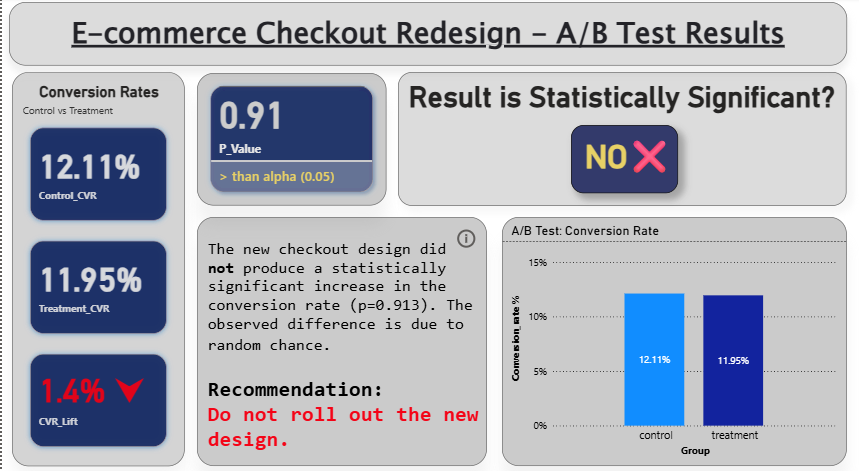

<h1 align="center"> 🛒 CartFlow Checkout Redesign — A/B Test Analysis</h1>

   
  
> *A well-powered checkout experiment that failed, and why blocking shipment was the correct decision.*

> **Product Analytics | Experimentation | Decision Ownership**

---

## ⚡ Executive Snapshot

**Problem**  
A redesigned checkout experience was proposed to improve purchase conversion.

**Decision**  
❌ **Do Not Ship.**

**Why**  
In a large, well-powered experiment (~289k users), the treatment failed to show any statistically significant uplift and exhibited a slight negative directional effect.

**Bottom Line**  
In a surface as critical as checkout, absence of evidence is evidence of risk. The redesign was correctly blocked.

---

## 📊 Dashboard Summary

> *Executive-facing view of the experiment outcome*

<div align="center">



</div>

---

> **🛑 Guardrail Monitor:**
> * **Latency:** 1.2s (Control) vs 1.25s (Treatment) — ✅ Stable
> * **Errors:** 0.05% (Control) vs 0.04% (Treatment) — ✅ Stable
>
> *While technical performance was stable, the primary business metric failed to justify the change.*

---

## 🏢 Business Context

This project is framed around **CartFlow**, a fictional high-volume e-commerce platform where checkout conversion directly impacts revenue.

Checkout is a **high-leverage surface**:
- Small regressions scale quickly
- User tolerance for friction is low
- “Neutral” changes are often negative in practice

My responsibility as a Product Analyst was to determine whether the redesigned checkout should replace the existing experience.

---

## 🎯 Objective & Hypothesis

### Objective  
Evaluate whether the redesigned checkout page produces a **statistically significant increase** in conversion rate compared to the existing checkout.

### Hypotheses  
- **Null Hypothesis (H₀):** Treatment ≤ Control  
- **Alternative Hypothesis (H₁):** Treatment > Control  

A one-sided hypothesis reflects the real product decision rule. Shipping only occurs if the redesign is strictly better.

---

## 🧪 Experiment Details

- **Experiment Type:** Randomized A/B Test  
- **Primary Metric:** Checkout Conversion Rate  
- **Statistical Test:** One-sided z-test for two proportions  
- **Significance Level (α):** 0.05  

### Sample Size
- **Control:** 144,252 users  
- **Treatment:** 144,349 users  
- **Total:** 288,601 users

### Assignment Integrity Check
The observed traffic split closely matched the expected 50/50 allocation, indicating **no Sample Ratio Mismatch (SRM)** and confirming correct experiment randomization.
 
This sample size provides sufficient power to detect even small practical effects.

---

## 🔍 Data Integrity & Cleaning

Before analysis, experimental correctness was enforced:

- Removed invalid group–landing page mismatches  
- Deduplicated users, treating conversion as binary  
- Ensured one valid experimental exposure per user

### Assignment Integrity Check (SRM)
A Chi-Square Goodness-of-Fit test confirmed the traffic split (49.98% vs 50.02%) was statistically valid (**p = 0.88**). This ruled out any sample ratio mismatch (SRM) caused by browser-specific assignment bugs or latency.

These steps prevent biased estimates and inflated significance.

---

## 📊 Results & Statistical Uncertainty

| Group      | Users | Conversions | CVR |
|-----------|-------|-------------|-----|
| Control   | 144,252 | 17,468 | **12.11%** |
| Treatment | 144,349 | 17,250 | **11.95%** |

- **Relative Lift:** -1.4%
- **p-value:** 0.913 (Not Significant)
- **95% Confidence Interval:** `[-0.42%, +0.10%]`

### Interpretation
The 95% confidence interval includes zero, confirming the null result. Crucially, the upper bound of the interval (`+0.10%`) suggests that even in the most optimistic scenario, the redesign offers **negligible upside**.

Given the engineering cost of maintaining a new codebase, a "negligible upside" is effectively a loss.

---

## 📌 Decision Rationale

This is a clear **Do Not Ship** decision.

- No statistical evidence of improvement  
- Directional movement is negative  
- Checkout is too critical to accept unproven changes  

A failed experiment at this scale is a valid and valuable outcome. It prevents a costly mistake.

---

## 🔍 Post-Test Diagnostics

A senior experiment does not end at “the test failed.”

While the aggregate result was flat, I recommended follow-up diagnostics to ensure the redesign did not introduce **asymmetric harm** across critical segments.

### Segmentation Considerations
Key questions proposed for deeper analysis:
- Did the redesign disproportionately impact **mobile users**, where checkout friction is highest?
- Were effects different for **new vs. returning customers**?
- Did conversion drop at specific checkout stages (payment entry, address confirmation)?

### Guardrail Metrics
Beyond conversion, checkout experiments must respect operational guardrails.

Even if conversion had been neutral, a statistically significant increase in:
- Page load latency  
- Client-side errors  
- Drop-offs during payment submission  

would independently block shipment.

These diagnostics help distinguish between a universally weak design and one that hides **segment- or platform-specific regressions**.

---

## 📂 Repository Structure
```
ecommerce-checkout-ab-test/
│
├── data/ # Raw datasets
├── sql/ # Validation, cleaning, and aggregation queries
├── python/ # Data cleaning and statistical testing
├── powerbi/ # Dashboard and documented DAX measures
├── images/ # Dashboard screenshots
└── README.md
```

---

## 🛠️ Tech Stack

- **SQL** — data validation and aggregation  
- **Python** — data cleaning and statistical testing  
- **Power BI** — executive reporting and decision communication  

---

## ⚠️ Limitations

- No segmented results included in the final analysis  
- No secondary guardrail metrics (e.g., latency, errors)  
- Short-term conversion only  

These limitations do not weaken the primary decision, given the strength of the null result.

---

## 📣 Final Note

This project demonstrates a core product analytics skill:

> Knowing when **not** to ship.

Strong experimentation is not about finding wins. It is about preventing confident mistakes, especially on high-impact surfaces like checkout.

